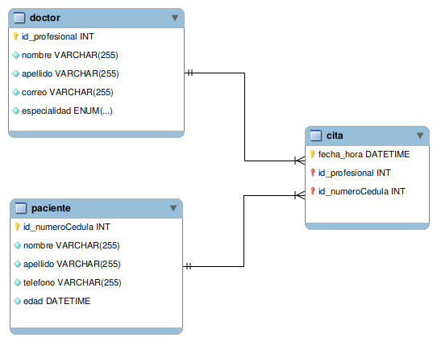
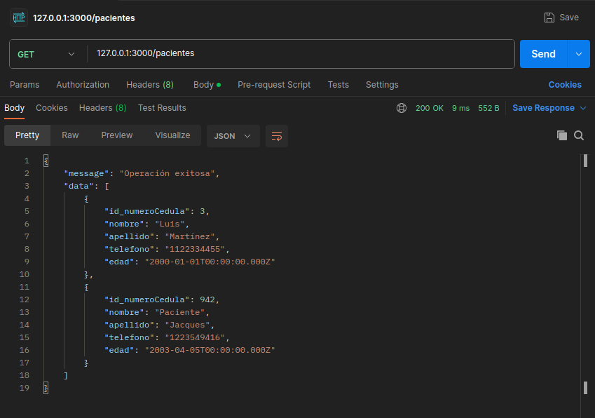
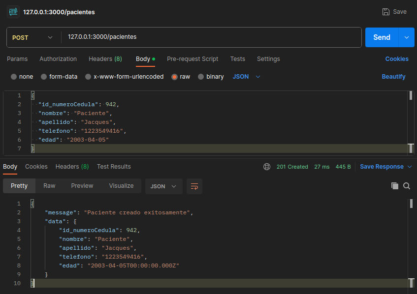
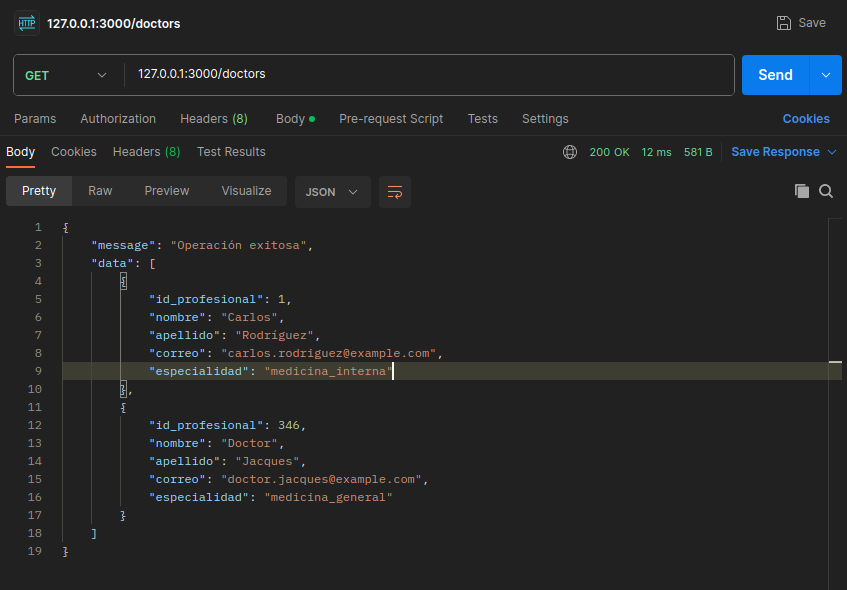
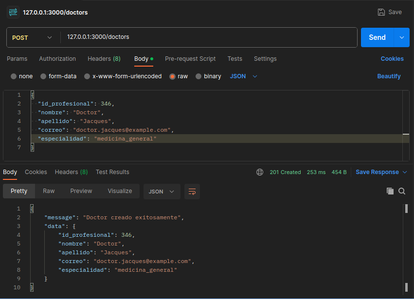
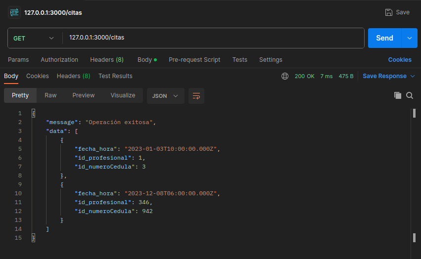
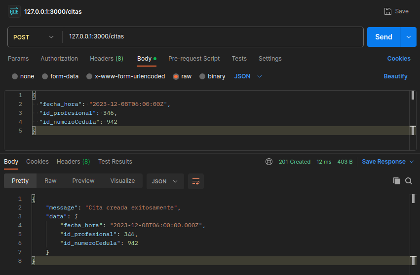

# API REST básica de citas médicas

Proyecto básico de API REST usando Node.js, Express.js, MySQL, Sequelize y Typescript.


## Características

- Node, Express, Typescript, MySQL y Sequelize como ORM Basic REST API
- Operaciones CRUD (A Controller for this)
- SQL for database: Relational MySQL - Use ORM Sequelize


## Tech Stack

- [Node](https://nodejs.org/en)
- [Express](https://expressjs.com/)
- [MySQL](https://www.mysql.com)
- [Typescript](https://nodejs.dev/en/learn/nodejs-with-typescript/)
- [Sequelize](https://sequelize.org)


## Instalación

Como prerequisitos necesitas tener instalado [Node.js](https://nodejs.org/en) y [MySQL](https://www.mysql.com) 

Abre una terminal o ventana de comandos y cambia el directorio de trabajo actual a la ubicación en donde quieres clonar el directorio.

**1. Clone este repositorio ejecutando el siguiente comando :**

```bash
 git clone https://github.com/JacquesAD/api_citas_ts.git
 cd api-citas-ts
```

**2. Instale las dependencias requeridas :**

```bash
 npm install
```

**3. Crea el archivo .env con la siguiente estructura :**

```
 HOST='127.0.0.1'
 PORT=3000
 DB='citas_db'
 USERNAME=*****
 PASSWORD=*****
```
En `USERNAME`y `PASSWORD` debe colocar el usuario y contraseña configurados en la instalación de MySQL, ambos entre comillas simples `'`. También puede cambiar si así lo desea el puerto `PORT` y nombre de la base de datos `DB`.

**4. Inicia el proyecto :**

```bash
 npm run dev
```

**4. Abra Postman y pruebe la API REST en la siguiente url `https://127.0.0.1:3000`**

Recuerde crear la base de datos con el nombre usado en el archivo .env. No es necesario crear las tablas u otra configuración, ya que esto es hecho por el ORM.


## Modelo de datos

El modelo de datos usado en este proyecto es el siguiente.




## Uso/Ejemplos

A continuación se pueden ver algunos ejemplos del uso de la API con Postman

**Ruta /pacientes**

- *Get*


- *Post*


**Ruta /doctors**

- *Get*


- *Post*


**Ruta /citas**

- *Get*


- *Post*



## Información general

Esta API ha sido desarrollada como parte del curso Back End intermedio para familiarizarse con los conceptos fundamentales de la programación y la construcción de aplicaciones web. 

Creado por Diego Dousdebés, basado en en https://github.com/norbeydanilo/api-citas-sequelize-ts.git 
